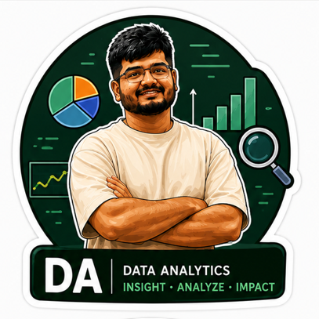
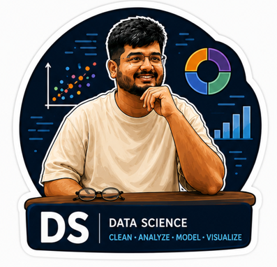

 

---

## About Me

Data Engineer & ML practitioner with **3+ years at Tata Consultancy Services**, now pursuing an **MS in Information Systems at Central Michigan University (GPA 3.9)**. I build end-to-end data systems — scalable ETL pipelines, cloud-native warehouses, and ML models — and communicate findings through dashboards and research.

- **Currently:** MS student at CMU + Research Assistant studying gig-economy labor trends
- **Research:** Co-authored paper accepted at **ICIS 2025 TREO** (Association for Information Systems)
- **Passion:** Bridging raw data to business decisions through engineering + modeling + storytelling
- **Award:** **Iron Viz Data Visualization Competition Winner** — CMU, Jun 2025

---

## Tech Stack

### Languages

### Machine Learning & AI

### Generative AI & LLMs

### Data Engineering

### Cloud & Databases

### BI & Visualization

### DevOps & Tools

---

## Experience Highlights

| Role | Company | Period | Impact |
|---|---|---|---|
| Senior Data & Software Engineer | Tata Consultancy Services | Oct 2022 – Aug 2024 | 1.5M+ records/day · 85% batch time reduction · 22% cost savings |
| Junior Software Engineer | Tata Consultancy Services | Oct 2021 – Sep 2022 | 12+ services · 20K+ daily API requests · 32% query speedup |
| Research Assistant | Central Michigan University | Jan 2025 – Present | 50K+ records analyzed · ICIS 2025 publication |

---

## Featured Projects

---

### &nbsp; AI & Machine Learning

 

<table>
<tr>
<td width="50%" valign="top">

**[JARVIS — AI Portfolio Agent](https://thrivikram-kotharu.github.io/myportfolio/portfolio.html)** &nbsp;·&nbsp; [GitHub](https://github.com/Thrivikram-Kotharu/myportfolio)

An LLM-powered chatbot deployed on my portfolio site, built with OpenAI APIs and served via Cloudflare Workers. Delivers real-time, context-aware responses about my background, projects, and skills.

`OpenAI API` `Cloudflare` `LLM` `RAG`

✦ 30% increase in profile engagement

</td>
<td width="50%" valign="top">

**[Airline Customer Satisfaction Prediction](https://thrivikram-kotharu.github.io/myportfolio/portfolio.html#projects)**

EDA + classification pipeline on 129K+ airline records. Compared Logistic Regression and Random Forest; identified inflight entertainment, seat comfort, and online booking as top satisfaction drivers.

`Python` `scikit-learn` `Logistic Regression` `Random Forest`

✦ 82.8% LR accuracy · **95.7% RF accuracy**

</td>
</tr>
<tr>
<td width="50%" valign="top">

**[Climate Policy & Emissions Forecasting](https://thrivikram-kotharu.github.io/myportfolio/portfolio.html#projects)**

Applied SMA, Exponential Smoothing, and multiple regression (R² ≈ 0.82) to project global CO₂ emissions under various policy scenarios. Used EN-ROADS simulation to optimize policy configurations targeting ~2°C warming limit.

`Python` `Time Series` `Regression` `EN-ROADS` `Optimization`

✦ R² ≈ 0.82 · identified optimal policy path for 2°C target

</td>
<td width="50%" valign="top">

**[Sales Performance Regression Analysis](https://thrivikram-kotharu.github.io/myportfolio/portfolio.html#projects)**

Built simple and multiple regression models (R² ≈ 0.99) to quantify the impact of advertising spend on sales. Used ANOVA for model selection and delivered forecasting scenarios for strategic planning.

`Python` `Linear Regression` `ANOVA` `Forecasting`

✦ R² ≈ 0.99 · advertising confirmed as dominant sales driver

</td>
</tr>
</table>

---

### &nbsp; Data Engineering & Cloud

 

<table>
<tr>
<td width="50%" valign="top">

**[Instamart Data Warehouse](https://thrivikram-kotharu.github.io/myportfolio/portfolio.html#projects)**

End-to-end dimensional model built on Snowflake and AWS S3. Designed Star Schema (1 fact + 5 dimension tables) and ELT pipelines transforming 3M+ records, enabling 7+ analytical use cases including basket trends, reorder rates, and peak-hour analysis.

`Snowflake` `AWS S3` `SQL` `Star Schema` `ELT`

✦ 40% query performance improvement · 3M+ records

</td>
<td width="50%" valign="top">

**[Spotify Playlist ETL Pipeline](https://github.com/Thrivikram-Kotharu/Spotify-Playlist-ETL-Pipeline-on-AWS)**

Serverless ETL pipeline ingesting Spotify API data through AWS Lambda, cataloged via Glue, stored in S3, and queried via Athena. Includes automated schema validation to catch drift before it reaches analytics layers.

`AWS Lambda` `AWS Glue` `S3` `Athena` `Python`

✦ 40% reduction in schema drift issues · sub-second ad-hoc queries

</td>
</tr>
<tr>
<td width="50%" valign="top">

**[Real-Time Data Streaming Pipeline](https://github.com/Thrivikram-Kotharu/Real-Time-Data-Analytics-Pipeline-using-AWS-Apache-NiFi-and-Snowflake)**

End-to-end streaming architecture processing 10K+ records per batch. Apache NiFi handles ingestion, Kafka manages the event stream, and Snowpipe loads into Snowflake with SCD Type 1 models. Containerized with Docker.

`Apache NiFi` `Kafka` `Snowflake` `Snowpipe` `Docker`

✦ Event-driven ingestion · SCD Type 1 · fully containerized

</td>
<td width="50%" valign="top">
</td>
</tr>
</table>

---

### &nbsp; Data Analytics & Visualization

 

<table>
<tr>
<td width="50%" valign="top">

**[Watt's Next: EVs & Clean Energy](https://public.tableau.com/app/profile/thrivikram.kotharu/viz/EVRenewableEnergy/MainDashboard)** &nbsp;·&nbsp; [Demo](https://www.youtube.com/watch?si=7RtTh0bRjEwUSeWQ&v=SPWvpULDuoU&feature=youtu.be)

Multi-source Tableau dashboard analyzing EV adoption trends, renewable energy growth, and CO₂ emissions across top global markets. Features dynamic filters, KPIs, and time-series comparisons.

`Tableau` `Data Storytelling` `KPI Design`

✦ 30% improvement in stakeholder insight delivery

</td>
<td width="50%" valign="top">

**[U.S. Employment & Education Market Story](https://public.tableau.com/app/profile/thrivikram.kotharu/viz/Jobs_17473436571380/MyStory)**

Interactive Tableau Story spanning all 50 U.S. states, connecting education attainment, unemployment rates, and job availability into a cohesive narrative for policy and business audiences.

`Tableau` `Story Points` `Labor Market Analysis`

✦ 40% engagement lift over static reports

</td>
</tr>
</table>

---

### &nbsp; Data Science & Research

 

<table>
<tr>
<td width="50%" valign="top">

**Gig Economy Labor Research** *(ICIS 2025)*

Statistical analysis of 50K+ records across 3 countries on gig-economy wages, benefits, and employment stability. Built dashboards and co-authored the resulting paper for ICIS 2025 TREO.

`Python` `SQL` `EDA` `Statistical Analysis` `Tableau`

✦ Published at ICIS 2025 — Association for Information Systems

</td>
<td width="50%" valign="top">
</td>
</tr>
</table>

---

## Certifications

| Certification | Issuer |
|---|---|
| AWS Certified Data Engineer – Associate | Amazon Web Services |
| Tableau Desktop Specialist | Tableau |
| Google Data Analytics | Google |

---

## Publication

> **Platform Governance and Gig Worker Benefits: A Socio-Technical Approach**
> Kata, L.B.S., **Kotharu, T.**, Huang, X.
> *ICIS 2025 TREO — Association for Information Systems (AIS)*

---

## Honors & Awards

- **Iron Viz Data Visualization Competition Winner** — Central Michigan University, Jun 2025
- **On The Spot Award** · **Applause Award** · **Star Team Award** · **Best Team Award** — TCS, 2022–2024

---

## Education

| Degree | Institution | Period | GPA |
|---|---|---|---|
| MS in Information Systems | Central Michigan University | Aug 2024 – May 2026 | 3.9 |
| B.Tech in Electrical & Electronics Engineering | ACE Engineering College | 2017 – 2021 | — |

---

## Let's Connect

Have a data problem worth solving? Let's talk.

&nbsp;

